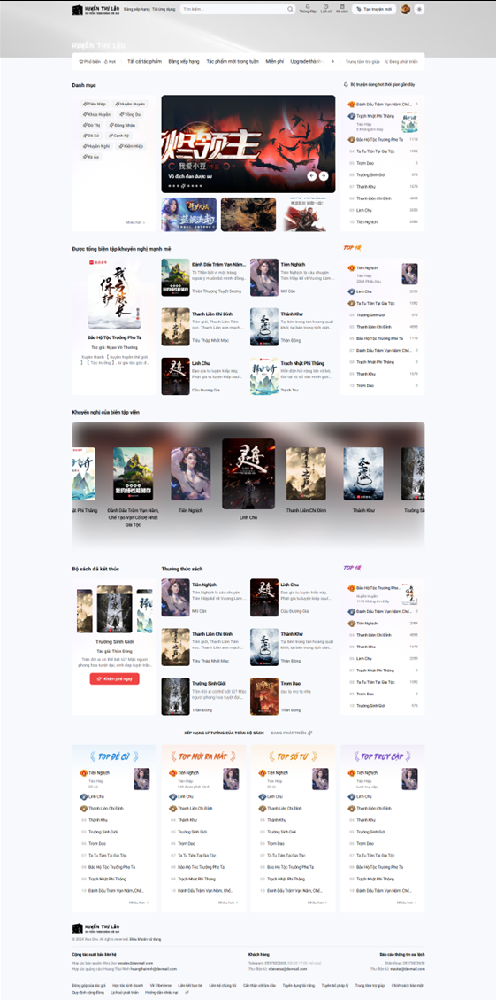
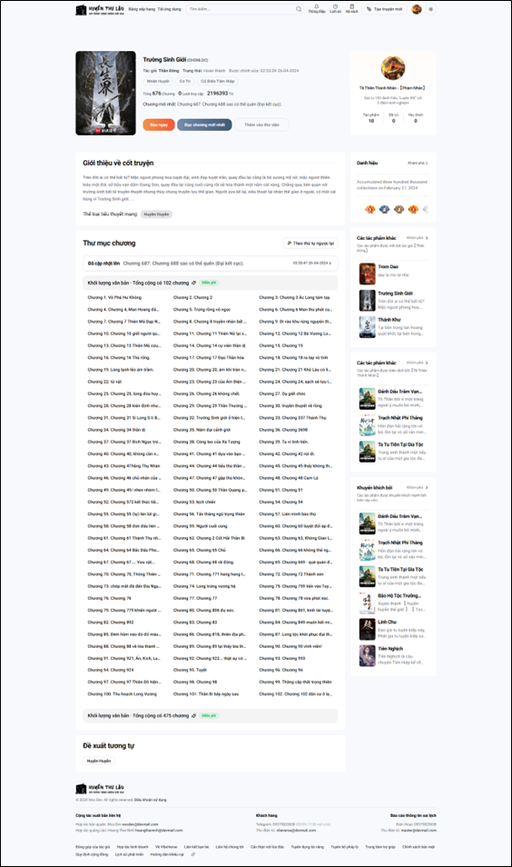
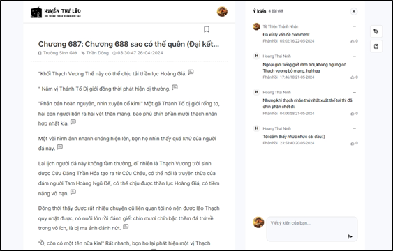

<!--  -->
<picture>
    <source media="(prefers-color-scheme: light)" srcset="apps\public\logo.svg">
    
  </picture>

 

# Welcome to the online novels repository

“We understand that you’re always seeking sources of inspiration for your writing and looking for captivating novels. Your talent shouldn’t go to waste. 
Novels is the perfect choice for you, with events that can stimulate competition and elevate your potential to new heights.”

<kbd>Home Page</kbd>

  <source media="(prefers-color-scheme: light)" srcset="assets/ui/home_page.png">
  

  
<kbd>Novel Detail Page</kbd>

  <picture>
    <source media="(prefers-color-scheme: light)" srcset="assets/ui/novel_detail_page.png">
    
  </picture>

  
<kbd>Read the novel in chapters & Chapter Comments Page</kbd>

  <picture>
    <source media="(prefers-color-scheme: light)" srcset="assets/ui/read_novels_and_comment_chapter_page.png">
    
  </picture>

  
<kbd>Search and ranking pages</kbd>

  <picture>
    <source media="(prefers-color-scheme: light)" srcset="assets/ui/search and ranking pages.png">
    
  </picture>

  
<kbd>Chapter summary popup</kbd>

  <picture>
    <source media="(prefers-color-scheme: light)" srcset="assets/ui/chapter summary popup.jpg">
    
  </picture>

  
<kbd>Translation by AI</kbd>

  <picture>
    <source media="(prefers-color-scheme: light)" srcset="assets/ui/translation by ai.png">
    
  </picture>

  
<kbd>New management and creation pages</kbd>

  <picture>
    <source media="(prefers-color-scheme: light)" srcset="assets/ui/new management and creation pages.png">
    
  </picture>

## 📑 License
Licensed under [AGPL-3.0](https://github.com/louiswalpurgis-dotdev/novels/blob/main/LICENSE).

[![][back-to-top]](#readme-top)

<!-- LINK GROUP -->

[back-to-top]: https://img.shields.io/badge/-BACK_TO_TOP-151515?style=flat-square
